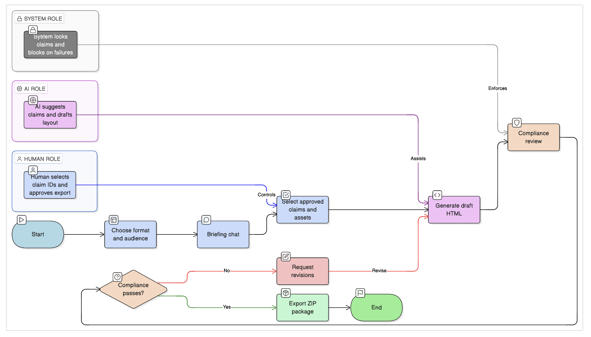
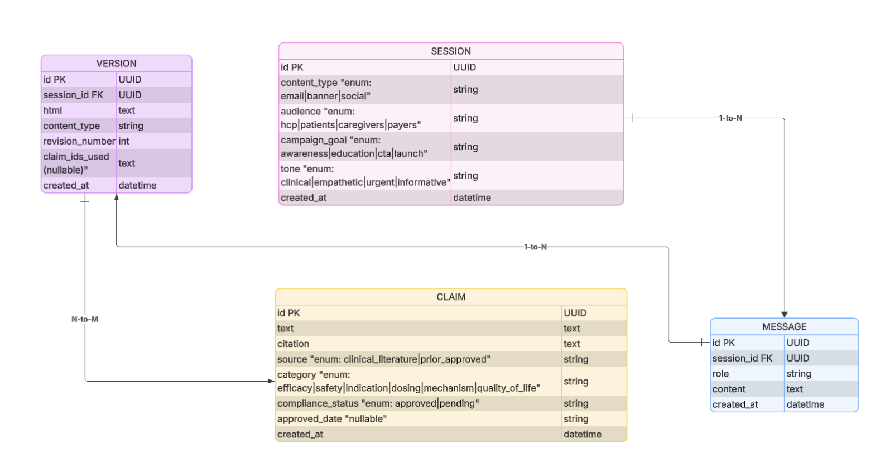

# Solistic Health — FRUZAQLA Content Generator

A proof-of-concept system enabling pharmaceutical marketers to generate FDA-compliant promotional content for **FRUZAQLA** (fruquintinib) through a conversational interface powered by **Anthropic Claude**.

## The Problem

Pharma companies need marketing content (emails, banner ads, social posts) where every statement must come from clinical literature or prior approved claims (FDA regulations). Content requires 5–10+ revision cycles and compliance checks before approval. This tool streamlines that workflow.

## Architecture

| Layer    | Stack                            | Port  |
|----------|----------------------------------|-------|
| Frontend | Next.js 15 (App Router, TS, TW)  | 3000  |
| Backend  | FastAPI + SQLite + Anthropic Claude | 8000  |
| LLM      | Claude (claude-sonnet-4-20250514) via Anthropic SDK | — |

---

## Part 1: Product Design & System Architecture

### 1.1 User Flow Design

#### High-Level User Journey Map



**Step 1: Request Creation (`/`)**
```
User lands on homepage
    │
    ├── Selects Content Format (email / banner / social)
    ├── Selects Target Audience (HCP / patients / caregivers / payers)
    ├── Selects Campaign Goal (awareness / education / CTA / launch)
    ├── Selects Tone (clinical / empathetic / urgent / informative)
    │
    └── Clicks "Start Briefing"
            │
            ├── POST /session → creates session with all parameters
            ├── Stores session_id in localStorage
            └── Navigates to /chat
```

**Step 2: Conversational Alignment (`/chat`)**
```
User enters chat interface
    │
    ├── Suggestion chips shown for quick start
    ├── User describes content needs in natural language
    │       │
    │       └── POST /chat/stream → SSE streaming response
    │               │
    │               ├── "Thinking (Xs)..." indicator with timer
    │               ├── "Thought for X seconds" label appears
    │               └── Assistant streams character-by-character
    │
    ├── Assistant asks clarifying questions (2-3 rounds)
    ├── Assistant suggests specific approved claims with citations
    ├── User can Clear Chat to restart briefing
    │
    └── User clicks "Continue to Preview →"
            │
            └── Navigates to /preview (session context carries over)
```

**Step 3: Claim Selection, Generation & Compliance (`/preview`)**
```
Claims Library loads (GET /claims/recommended)
    │
    ├── Claims displayed grouped by category:
    │       Indication → Efficacy → Mechanism → Dosing → QoL → Safety
    │       Each shows: source badge, citation, approval date
    │
    ├── User selects claims (checkboxes, Select All / Clear)
    │       DECISION POINT: User explicitly approves each claim
    │
    ├── "Generate Content" → POST /generate
    │       │
    │       ├── LLM generates HTML
    │       ├── Saved as new Version in DB
    │       ├── Rendered in sandboxed iframe
    │       └── Auto-triggers compliance review
    │
    ├── Compliance Review Panel (12-point check):
    │       ├── Green = pass
    │       ├── Yellow = warning (non-blocking)
    │       └── Red = fail (blocks export)
    │
    ├── Iterative Editing Loop:
    │       ├── User types natural language instruction
    │       │       e.g., "Move safety above efficacy"
    │       ├── POST /edit → LLM applies edit
    │       ├── New Version saved, compliance auto-rechecks
    │       └── Repeat until satisfied
    │
    ├── Version History:
    │       ├── All revisions listed with timestamps
    │       └── "Load" to restore any previous version
    │
    └── DECISION POINT: Export gate
            ├── If any red flags → export blocked
            └── If all pass/warn → "Export Package" enabled
```

**Step 4: Export & Distribution**
```
User clicks "Export Package"
    │
    ├── POST /export
    │       ├── Runs final compliance review
    │       ├── Blocks if any failures remain
    │       └── Returns ZIP package
    │
    └── Downloads 1 file:
            └── fruzaqla-export-revN.zip
                    ├── html/index.html          (full HTML content)
                    ├── metadata/claims.json      (sources, citations, approval dates)
                    ├── metadata/assets.json     (asset manifest)
                    ├── compliance/report.json   (overall status, reviewed_at, all checks)
                    └── manifests/asset_manifest.csv
```

### 1.2 System Architecture


### 1.3 Data Model Design



---

## Quick Start

**Backend** (port 8000)
```bash
cd backend && python3 -m venv .venv && source .venv/bin/activate
pip install -r requirements.txt
cp .env.example .env   # Set ANTHROPIC_API_KEY
uvicorn main:app --reload --port 8000
```

**Frontend** (port 3000)
```bash
cd frontend && npm install && npm run dev
```

Open [http://localhost:3000](http://localhost:3000). Run `POST /ingest` to load claims and assets.

## LLM Integration

The system uses Anthropic Claude for three capabilities:

| Feature | Endpoint | What Claude Does |
|---------|----------|------------------|
| **Conversational briefing** | `POST /chat` | Guides the user through audience, messaging, and content requirements with FRUZAQLA domain knowledge |
| **Content generation** | `POST /generate` | Generates complete HTML (email/banner/social) using only the approved claims provided, respecting FDA fair-balance rules |
| **Natural-language editing** | `POST /edit` | Applies arbitrary edits to HTML while preserving ISI, references, and compliance constraints |

Each function has a specialized system prompt that enforces:
- Only approved claim text may appear (no fabricated data)
- FDA fair balance (efficacy must be accompanied by safety)
- ISI and references sections are preserved
- Content is format-appropriate (email 640px, banner 728×90, social card)

If the LLM call fails or no API key is set, every endpoint gracefully falls back to deterministic stub logic.

## Workflow

1. **Landing** (`/`) — Choose content format (HCP email, banner ad, social post) and start a session.
2. **Briefing** (`/chat`) — Describe audience, key message, clinical focus. Claude asks targeted follow-ups.
3. **Preview** (`/preview`) — Select approved claims (grouped by category), run compliance checks, generate HTML via Claude, iterate with natural-language revisions, and manage version history.

## API Endpoints

| Method | Path                     | Description                                  | LLM? |
|--------|--------------------------|----------------------------------------------|------|
| POST   | `/session`               | Create session with content_type             | —    |
| POST   | `/chat`                  | Send message, get Claude reply               | Yes  |
| GET    | `/claims/recommended`    | Get claims ranked by conversation context    | —    |
| POST   | `/generate`              | Generate HTML from selected claims + assets   | Yes  |
| POST   | `/edit`                  | Apply a natural-language revision            | Yes  |
| POST   | `/compliance-review`     | Run compliance checks (claims, assets, ISI)   | —    |
| POST   | `/export`                | Export zip (HTML, metadata, compliance, manifest) | —    |
| GET    | `/versions`              | List versions for a session                  | —    |
| GET    | `/versions/{version_id}` | Get full HTML for a version                  | —    |
| GET    | `/assets`                | List approved assets for picker              | —    |
| GET    | `/assets/{asset_id}`     | Serve approved asset file                    | —    |
| GET    | `/health`                | Health check                                 | —    |

## Tech Stack

- **Frontend**: Next.js 15, TypeScript, Tailwind CSS v4
- **Backend**: FastAPI, SQLAlchemy, SQLite
- **LLM**: Anthropic Claude
